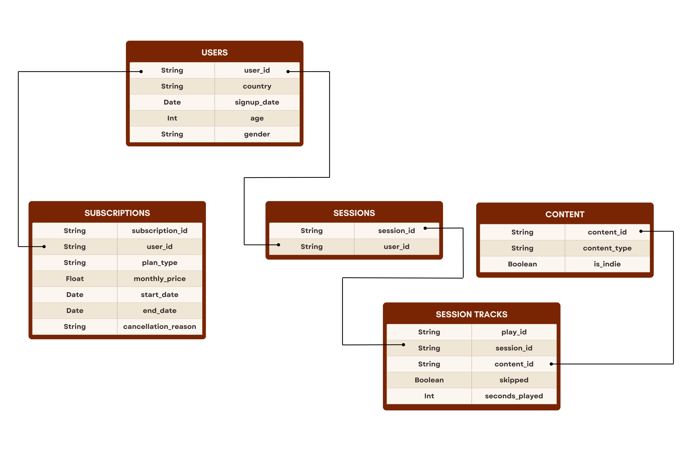
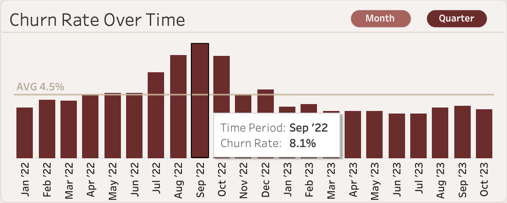
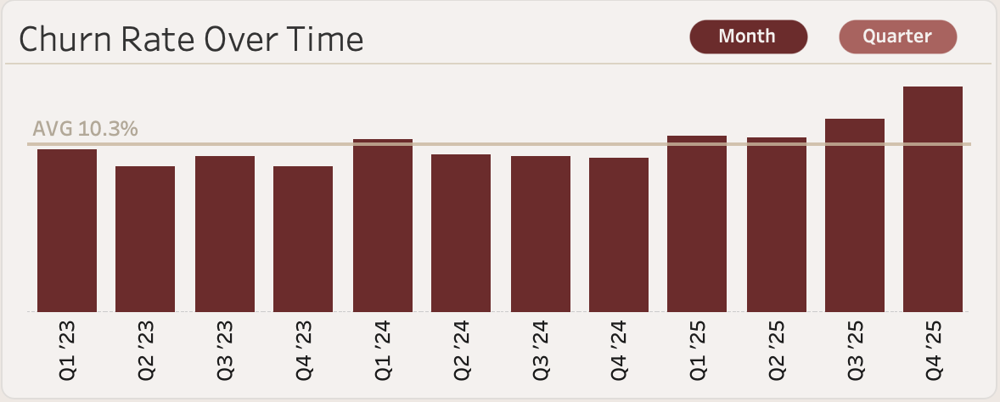
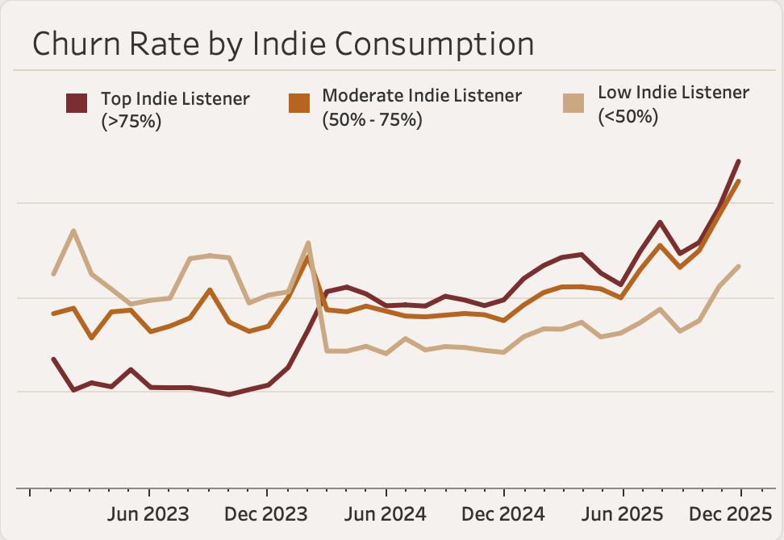
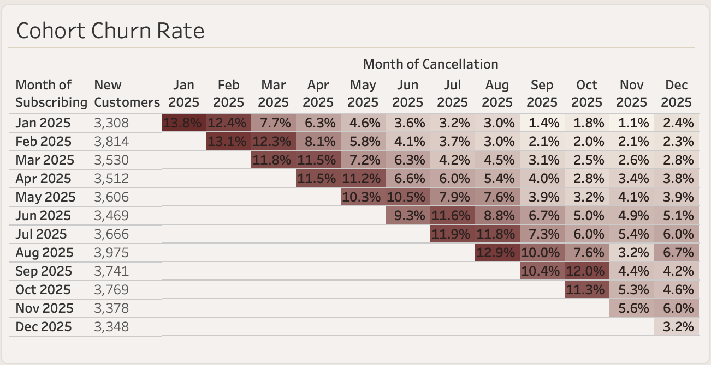
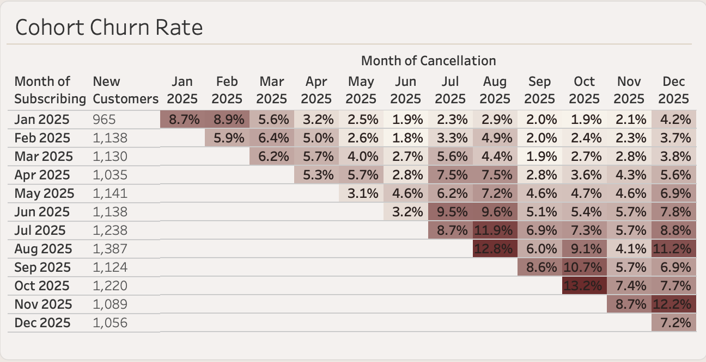
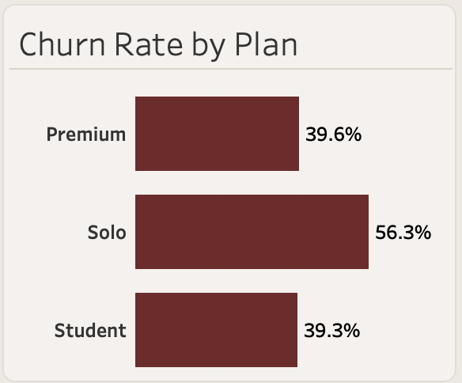

## Client Background
**WaveLength** is a music and podcast streaming service branded around promoting **independent (indie) artists**. Established in **2019**, the company experienced growth and popularity due to its niche. **In 2022, new competition** challenged the company's market dominance, causing a temporary spike in subscriber cancellations before usage stabilized in the following months. **Looking to expand its customer base in 2024**, the company began **incorporating more mainstream content**, which pushed away users who had joined specifically to support independent creators.

WaveLength's three-tiered plan system includes: **Premium ($11.99)** allows offline downloads alongside full platform access, **Solo ($6.99)** provides full streaming access without offline downloads, and **Student ($3.99)** offers a discounted version of Premium for eligible users.

The company's database includes records for approximately **317,000 users** and over **353,000** subscriptions. The available data includes user demographics, subscription details, and content consumed by users.

A Tableau dashboard was built to inspect churn patterns across subscription plans, tenures, and user demographics. This analysis highlights key insights discovered from the dashboard, along with recommended next steps for WaveLength to address these findings.

Find the full dashboard [here](https://public.tableau.com/app/profile/julia.li1289/viz/WavelengthCustomerChurnDashboard/Dashboard).

## Data Structure

The database contains five different tables:
- **Users**: Subscriber demographics and account details
- **Subscriptions**: Plan type, pricing, and cancellation details
- **Sessions**: Individual listening sessions per user
- **Session Tracks**: A track record of each piece of content listened to and how long it was played
- **Content**: Identifies each track or episode played

## 1. What Happened: Two Key Events

- **July 2022 — Competitor launch.** A new, well-funded competitor entered the streaming market in July 2022, and churn rose sharply across all plans in the following two months, concentrated among Solo and Student tier users, peaking at **8.1% in September 2022** (up from a 4.1% average from January 2021 – June 2022). Recovery began within two quarters as the initial novelty of the competitor's launch wore off, with churn lowering to **4.5% by November 2022**.

  
   
  <em>Churn spike in Q3 2022, but quickly recovered.</em>

- **January 2024 — A push towards mainstream content.** This is the more concerning shock. As part of a deliberate strategy to broaden the platform's appeal beyond its early niche/indie base, WaveLength updated its recommendation algorithm to surface more mainstream, major-label content over independent creators, reinforced by a broader marketing push emphasizing mainstream music. Unlike the competitor launch in 2022, it didn't produce a one-quarter spike in churn, but rather a steady increase over the two past years with quarterly churn rates climbing from **9.0% in Q4 2023 to 13.9% by Q4 2025**. Top indie consumers on the platform (users with >75% of their content consumption being indie) now churn **roughly 1.5x more** than low indie listeners. This suggests that the mainstream push came at a real cost of damaging the platform's core differentiator in promoting independent creators, rather than simply broadening its content to appeal to more users.
<table align="center">
  <tr>
    <td align="center" width="450">
       
      <em>Quarterly churn rate has gradually increased since the 2024 mainstream push.</em>
    </td>
    <td align="center" width="450">
       
      <em>Top indie listeners went from having the lowest churn rates in 2023 to the highest churn rates in 2024 and 2025.</em>
    </td>
  </tr>
</table>

## 2. Plan Level Churn
- **Premium ($11.99):** Premium users have the longest average tenure, averaging **12.2 months longer** than the average Solo user in 2025, reflecting the greatest brand loyalty. They also make up the largest share of top indie listeners, making up **60% of this group** in 2025, showing that this segment resonates most strongly with the platform's core identity. This is a major concern, as the company is losing its most loyal and highest paying customer segment following the mainstream content push.

- **Solo ($6.99):** Solo users show substantially higher and more consistent churn in their first two months than Premium users, with 2025 cohort churn typically in the **10–14% range** for Solo, compared to a much more variable **3–13%** for Premium. This early drop-off suggests Solo users are more likely to be evaluating the platform on a trial basis, quick to leave if it doesn't immediately meet their expectations, rather than staying long enough to build the loyalty seen in higher tiers.
<table align="center">
  <tr>
    <td align="center" width="600">
       
      <em>2025 Solo plan cohort chart</em>
    </td>
    <td align="center" width="600">
       
      <em>2025 Premium plan cohort chart</em>
    </td>
  </tr>
</table>

- **Student ($3.99):** Has the lowest total churn rate of all plans since 2024 at **39.3%**, which is on par with Premium's **39.6%** and far below Solo's **56.3%**, while also posting the largest growth in active users since 2024 with a **71% increase** compared to **15%** for all other plans. This likely reflects the platform's shift toward mainstream content resonating with a broader, younger audience.
  

  
   
  <em>Total churn rate for each plan from 2024 to 2025</em>

## 3. Cancellation Reasons

- **"No longer use"** is the top cancellation reason across all plan types in 2025, accounting for **26.0%** of all cancellations. This indicates much of the churn reflects disengagement with the platform rather than dissatisfaction.
-  **"Too expensive"** and **"found alternative"** follow closely at **24.6%** and **22.2%**. Price sensitivity is consistent across all plans, while "found alternative" skews moderately more common among Solo subscribers, reinforcing the noncommittal and trial-oriented churn pattern seen in Section 2.
- **"Missing content"** accounts for **19.7%** of cancellations platform-wide from 2024 to 2025, but climbs to **26.3%** in the same period when filtered to only include top indie listeners, further indicating that this segment's churn is driven largely by the brand's 2024 transition from indie to mainstream content.
- The remaining reasons, including **"hard to use" (6%)** and **"not what I expected" (3%)**, stay relatively flat across plans and time periods, suggesting they aren't meaningfully tied to any events or churn patterns.

## 4. Recommendations

1. **Reaffirm WaveLength's indie roots.** Reclaim churned indie listeners and prevent further cancellations by reinforcing that WaveLength remains a platform built to promote and support independent creators. This could include features that appeal specifically to indie listeners, such as a dedicated independent artist discovery page and expanded collaborations with popular indie creators. WaveLength should also personalize its recommendation algorithm based on each user's individual listening habits, ensuring high-indie listeners continue to see indie content prominently rather than being pushed to a mainstream feed.

2. **Tailor marketing for the Student plan to lean mainstream.** The Student plan is the one tier that has seen customer growth (71% increase since 2024) and higher retention since the mainstream content push. Continue leaning into mainstream marketing to attract and retain younger users, since this segment has shown the strongest response to the platform's content shift.

3. **Use a discounted Premium trial to make Solo subscribers stickier.** Solo users have consistently proven to be WaveLength's least sticky tier, with a churn rate 5x that of Premium's following the introduction of a new competitor in 2022, and cohort monthly churn rates that consistently hit the 10-14% range in the first two months of their plan in 2025. Offering Solo subscribers a one-time discounted Premium trial could (1) increase conversion to Premium, WaveLength's stickiest tier, and (2) build loss aversion by giving users temporary access to offline downloads and the chance to build a personal library, which is something they'd lose if they cancelled.

4. **Reengage users with new features and content.** "No longer use" is the most frequent cancellation reason cited by users, suggesting a large share of churn comes from disengagement with the platform rather than dissatisfaction. WaveLength can counter this with fresh content, such as artist interviews or radio shows, alongside engaging features like monthly listening recaps or AI curated playlists.

